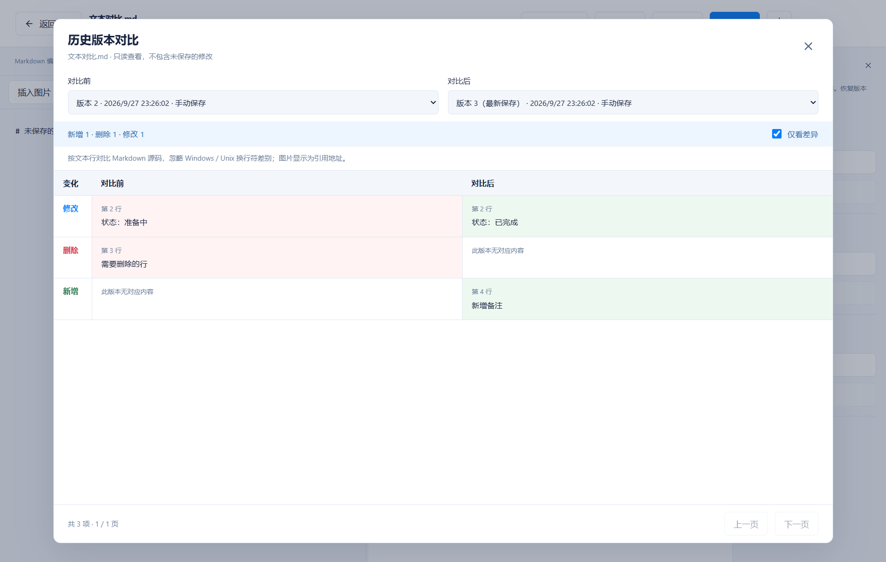
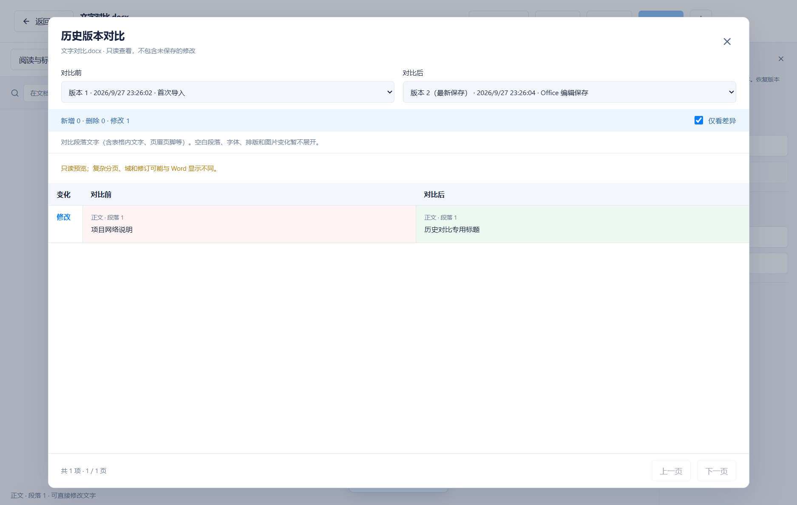
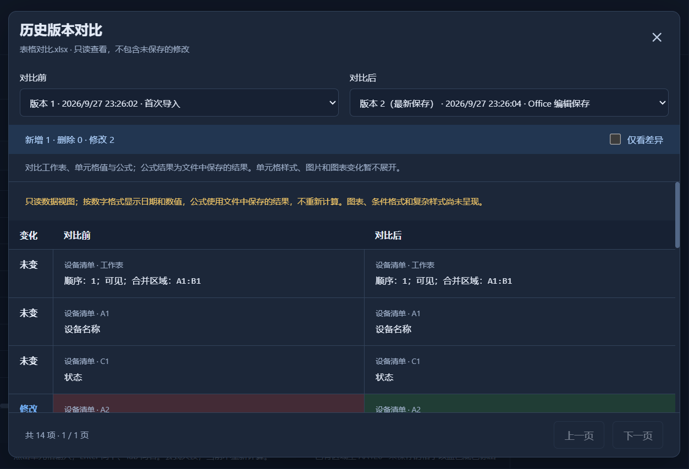

# 0.8.0 历史对比与直接编辑验收

日期：2026-09-27。面向 Windows x64 本地 EXE，无新增运行依赖、数据库升级或远程服务。

## 使用方法

1. 打开文档，点击顶部“历史版本”。
2. 点击某条记录的“查看差异”。默认以该版本和最新保存版本比较；从最新记录进入时，默认对比上一个版本。
3. 两个下拉框可任选已保存版本。“仅看差异”显示新增、删除和修改，取消勾选可阅读全部内容，每页 100 项。只有一个版本时入口为“查看内容”。
4. 点击关闭或按 Escape 返回编辑器。对比不包含未保存修改，不覆盖编辑内容或恢复草稿。恢复旧版本仍使用历史栏的独立按钮，未保存修改时不可恢复。

首页点击“编辑”后，Word 直接显示可编辑页面，Excel 直接显示编辑网格，无需再点“编辑内容”。新建 Word / Excel 同样直接编辑。点击“打开”或双击文件仍进入阅读，以保留搜索定位和标记流程；页面内可随时切换阅读与编辑。

## 范围

- Markdown：按源码行比较，显示原行号，新增 / 删除 / 修改分别标识；保留空行和末尾换行差异，忽略 CRLF / LF 编码差别。图片显示引用地址。
- Word：比较正文、表格内文字、页眉页脚等已解析段落；按段落内容对齐，插入一段不会让后面的所有段落都显示修改。空白段落、排版、字体和图片差异暂不展开。
- Excel：按工作表名和真实单元格地址对齐，比较显示值、原始数值和公式；工作表顺序、隐藏状态、合并范围也会显示。公式结果为保存缓存，不重新计算；样式、图片和图表差异暂不展开。
- 内容相同但文件摘要不同，会提示文件仍有其他变化，不误称两个文件完全相同。
- Markdown 两侧合计最多 10 万行；Office 沿用现有解析大小、数量和超时限制。较大段内容完全重写时按位置配对，并说明数量仅供参考。损坏或超限读取报错并可重试，不显示假空白结果。

## 验证范围

类型检查、格式检查、生产构建和 71 项单元测试通过。实际包内 `release/0.8.0/win-unpacked/我的文档库.exe` 的 12 组桌面回归全部通过，新增历史对比场景也在该 EXE 中运行通过。

`tests/version-diff.test.ts` 覆盖插入、删除、修改、重复行、空行、反向对比、相同版本、较大文本、资源上限、随机重复文本顺序保全、Word 部件对齐、Excel 原始值 / 公式 / 隐藏表与合并区域，以及正文相同但文件字节不同。

`tests/library.test.ts` 验证历史读取不修改当前正文、最近使用、版本列表和恢复草稿；无效版本和其他文档的版本不可读取。

`scripts/history-smoke.mjs` 在独立测试库内验证真实窗口操作：三种格式的差异显示、任意版本选择、相同版本和单版本内容、205 项分页与切换重置、关闭与 Escape、返回原按钮、对比期间 Ctrl+S 不保存背景、未保存编辑和草稿保持、浅深主题、1000 px 小窗口、原件不变、Office 当前索引不被历史覆盖、损坏文件提示，以及首页直接编辑 / 普通阅读和新建两种 Office 文件的直接编辑。

完整打包回归还覆盖原有导入、分类、收藏、标记、主题、备份恢复、导出、Office 编辑、提示计时、两处拖动分栏、搜索定位及重启持久化。

测试均使用合成资料及独立数据目录，没有写入日常文档库。本版没有自动安装或关闭用户的旧版窗口；安装向导、跨 Windows 系统及覆盖安装需另行验收。

## 截图

